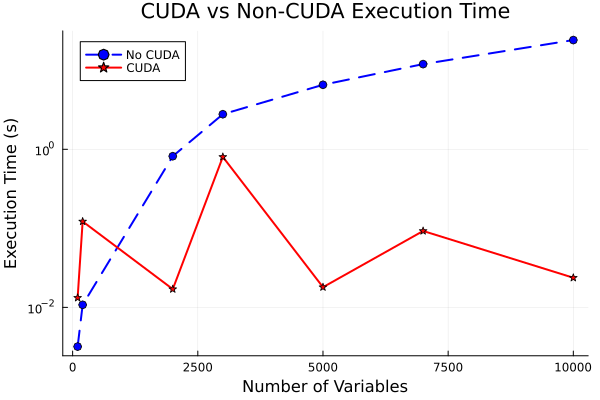

# Benchmarking L-BFGS Optimization with and without CUDA Acceleration

The package can be used to evaluate the performance of the L-BFGS optimization method for various functions, both with and without CUDA acceleration. The functions for which benchmarking can be tested out of the box are:

- **Gaussian Function** 
- **Gaussian with Squared Input**
- **Quadratic Function** 

A single benchmarking test is performed with increasing solution sizes, and the execution time (mean and minimum) for both CPU and GPU implementations is recorded.

The performance is measured using BenchmarkTools, with benchmarking being run on both CPU and GPU (using CUDA). Results, including computation times can be stored in a DataFrame format for further analysis. The optimization function is selected based on a user string input (f_str), allowing for flexible function testing.

At first the CUDA version was very very fast. However the results were not really that good. This speed comparison is the first plot.
# Old approach -> Nice time, bad results

In the end i managed to repair the mistake, but at what cost.
Probably due to high memory allocations for huge matrices the CUDA version is now very slow and obviously needs some optimization. You can see this sad truth on a graph below this text.
# New approach -> Nice results, bad time

