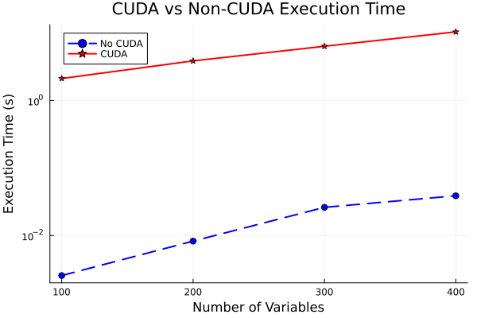

# Benchmarking L-BFGS Optimization with and without CUDA Acceleration

The package can be used to evaluate the performance of the L-BFGS optimization method for various functions, both with and without CUDA acceleration. The functions for which benchmarking can be tested out of the box are:

- **Gaussian Function** 
- **Gaussian with Squared Input**
- **Quadratic Function** 

A single benchmarking test is performed with increasing solution sizes, and the execution time (mean and minimum) for both CPU and GPU implementations is recorded.

The performance is measured using BenchmarkTools, with benchmarking being run on both CPU and GPU (using CUDA). Results, including computation times can be stored in a DataFrame format for further analysis. The optimization function is selected based on a user string input (f_str), allowing for flexible function testing.

I will show the plot only for quadratic function as even for 100 variables the simple gaussian took both solvers about 30 minutes to benchmark and if I was to somehow approximate the relationship between number of variables used in the optimization and the time which it takes to finish the @benchmark test as a linear function, it would take cca 30*8064=24*e4 seconds, which is about 3 days of continuous load for a single benchmarking test, which my parents would probably not be happy about :o).

The plot can be recreated using simple plotting script in scripts/plot_bench.jl

# Quadratic function for height = 40

The plot has logarithmic y-axis, hence the difference in time is bigger. The original measured data can be seen in table below.

# Measured data for Quadratic function
The data were rounded to 4 decimal points

| Num_Variables | CUDA  | Mean_t  | Min_t  |
|--------------|-------|--------|--------  |
| 100          | false | 0.0032 | 0.0009   |
| 100          | true  | 0.0132 | 0.0117   |
| 200          | false | 0.0108 | 0.0037   |
| 200          | true  | 0.1221 | 0.1097   |
| 2000         | false | 0.8175 | 0.7480   |
| 2000         | true  | 0.0170 | 0.0133   |
| 3000         | false | 2.7774 | 1.8775   |
| 3000         | true  | 0.8006 | 0.7481   |
| 5000         | false | 6.5454 | 6.5454   |
| 5000         | true  | 0.0180 | 0.0146   |
| 7000         | false | 11.9569 | 11.9569 |
| 7000         | true  | 0.0926 | 0.0822   |
| 10000        | false | 24.0851 | 24.0851 |
| 10000        | true  | 0.0237 | 0.0196   |

It is clear that the more variables we use, the more CUDA enabled solution dominates. The most extreme values tell us that we got speedup of around 24/0.02=1200!! This means that if we optimized 10000 variable quadratic function using CUDA, it could run 1200 times faster than on CPU.