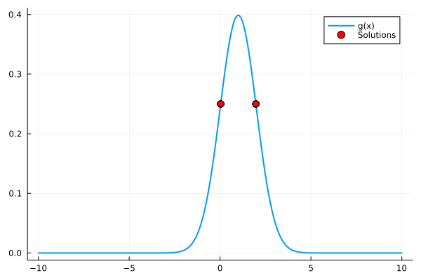
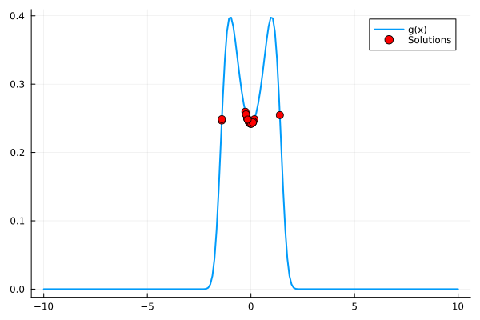
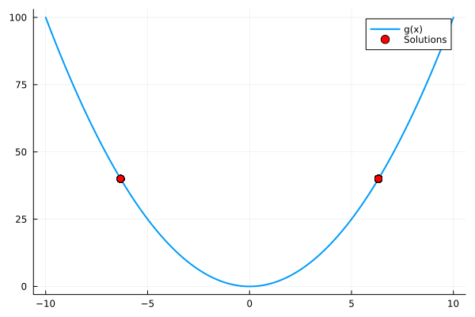

# Solution to L-BFGS kernelization

The implementation that solves the CUDA incompatibility is in `/src/Optim_dispatch.jl`.

Key modifications:
- **Array → CuArray conversion**
- **Avoiding scalar indexing** (as it reduces GPU parallelism)
- **Correctly using broadcasting (`.`) instead of loops**

# Example fix:
x .= x .+ epsilon  # Instead of `for` loops

# Example solutions to underlying HEP problem
As the solutions to higher dimensional problem tend to be hard to vizualize, I have selected 3 nonlinear one dimensional functions to serve as proof of concept. As we optimize at the same time over 500 variables, it can be seen as highly-multinomial optimization. The tested functions are listed below.

- **Quadratic function**
- **Gaussian function**
- **Gaussian function with squared input**
500 solutions were computed using L-BFGS with CUDA and filtered so that only converged solutions were visible. The convergence issue has nothing to do with GPU as this happens also with the base L-BFGS. This is the reason why we need very fast L-BFGS, as we need more solutions than required to filter out outliers.

This can be seen in \scripts\draw_sols.jl, where user can interactively choose drawn function and parameters of the functions.

After 1 run of L-BFGS with CUDA the solutions are shown here for each respective function.

As the underlying problem does not require precise solution, but rather an interval in which we should do additional computations, this filtering method is quite suitable for this specific problem.

# Gaussian for height = 0.25

# Gaussian with squared input for height = 0.25

# Quadratic function for height = 40
